# 🌱 Eco Coins - App Flowchart

Diese Datei enthält verschiedene Flowcharts für die Eco Coins App im Mermaid-Format.

## Hauptnavigation & App-Flow

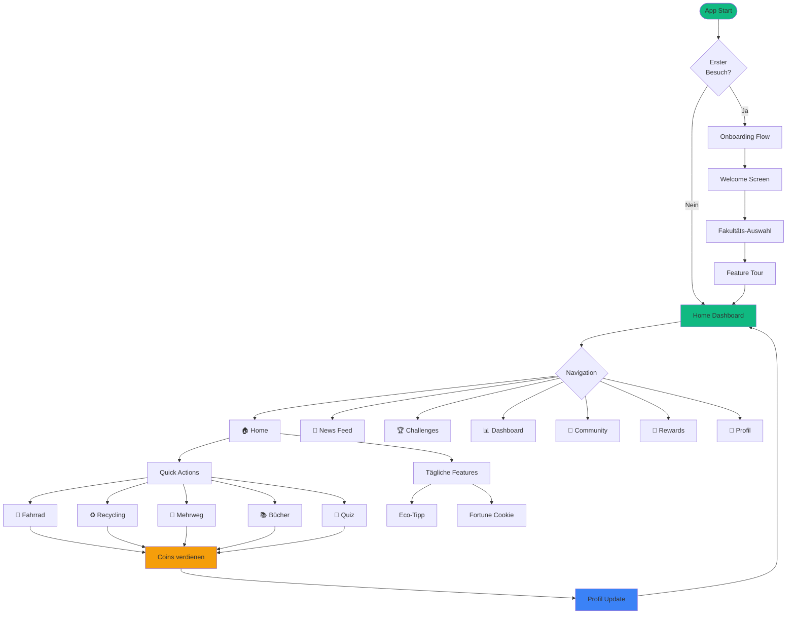

## Onboarding Flow (Detailliert)

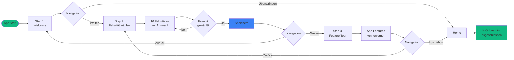

## Challenge-System Flow

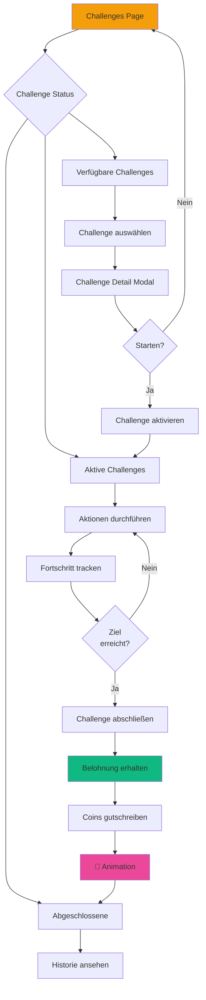

## Quick Actions Flow

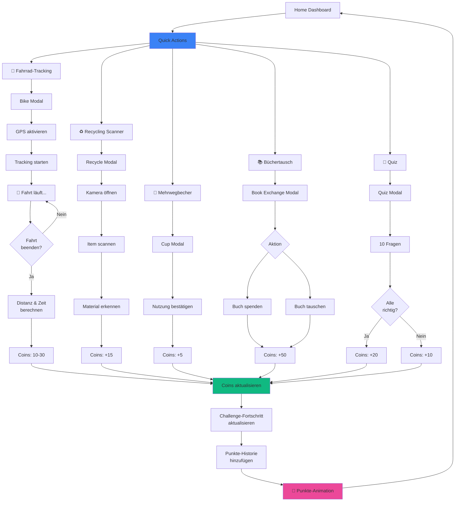

## Belohnungs-System Flow

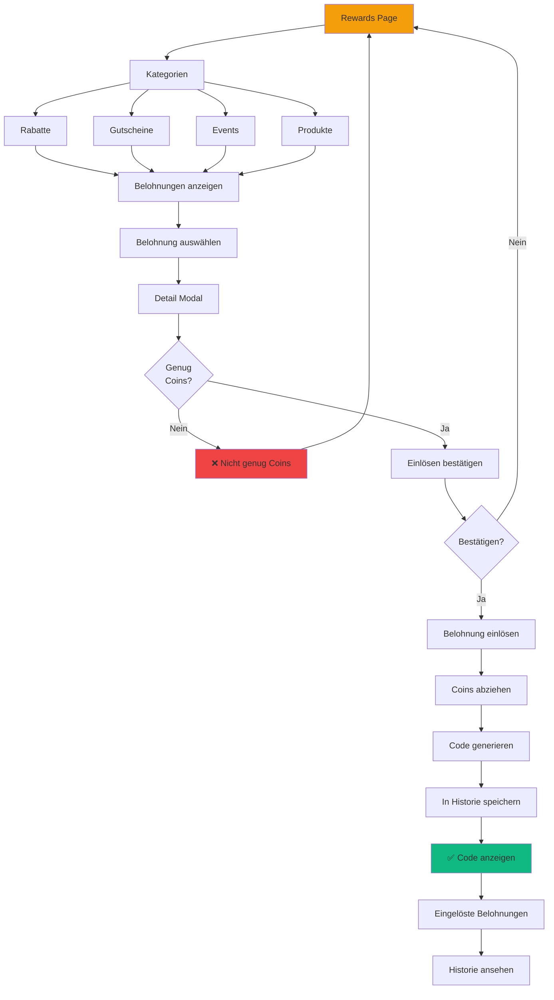

## Community & Rangliste Flow

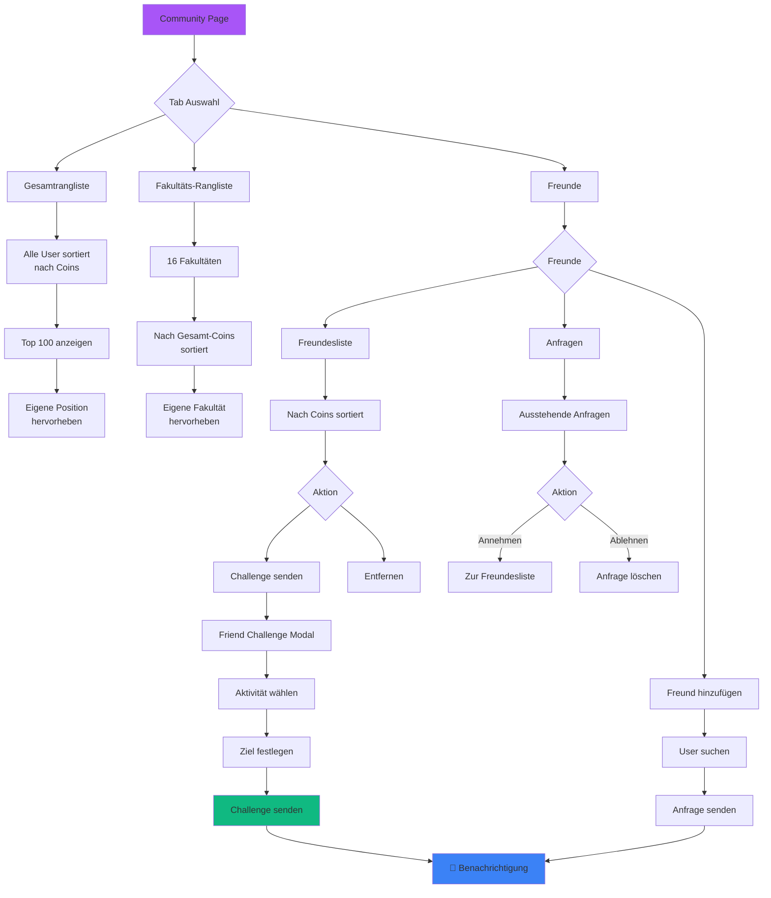

## News & Events Flow

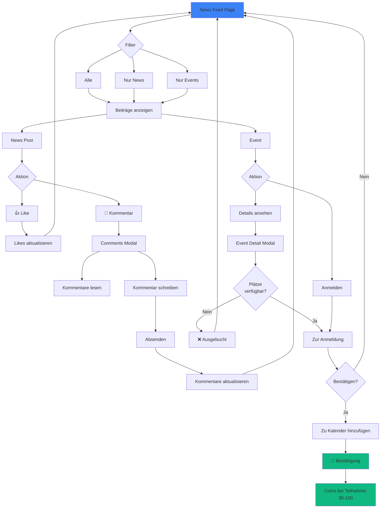

## Dashboard & Analytics Flow

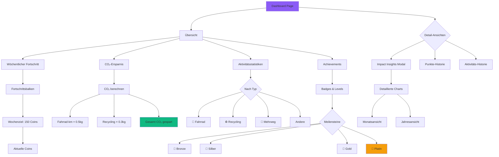

## Profil & Einstellungen Flow

```mermaid
graph TB
    Profile[Profil Page] --> ProfileInfo[Profilinfo]
    
    ProfileInfo --> UserData[Name & Email]
    ProfileInfo --> FacultyInfo[Fakultät]
    ProfileInfo --> LevelInfo[Level & Streak]
    ProfileInfo --> CoinsDisplay[Eco Coins]
    
    Profile --> QuickStats[Schnellstatistiken]
    QuickStats --> TotalActivities[Gesamte Aktivitäten]
    QuickStats --> TotalCO2[Gesamt CO₂]
    QuickStats --> CurrentStreak[Aktueller Streak]
    
    Profile --> Settings[⚙️ Einstellungen]
    
    Settings --> SettingsPage[Settings Page]
    SettingsPage --> SettingsOptions{Einstellungen}
    
    SettingsOptions --> Language[Sprache]
    SettingsOptions --> Notifications[Benachrichtigungen]
    SettingsOptions --> DarkMode[Dark Mode]
    SettingsOptions --> Privacy[Datenschutz]
    SettingsOptions --> Account[Account]
    
    Language --> LangToggle{Wechseln}
    LangToggle -->|DE| SetGerman[Deutsch]
    LangToggle -->|EN| SetEnglish[English]
    SetGerman --> UpdateUI[UI aktualisieren]
    SetEnglish --> UpdateUI
    
    Notifications --> NotifSettings{Kategorien}
    NotifSettings --> ChallengeNotif[Challenges]
    NotifSettings --> NewsNotif[News & Events]
    NotifSettings --> CommunityNotif[Community]
    NotifSettings --> FriendNotif[Freunde]
    
    ChallengeNotif --> Toggle1[An/Aus]
    NewsNotif --> Toggle1
    CommunityNotif --> Toggle1
    FriendNotif --> Toggle1
    
    DarkMode --> ThemeToggle{Umschalten}
    ThemeToggle -->|Light| LightTheme[☀️ Light Mode]
    ThemeToggle -->|Dark| DarkTheme[🌙 Dark Mode]
    LightTheme --> ApplyTheme[Theme anwenden]
    DarkTheme --> ApplyTheme
    
    Privacy --> PrivacySettings{Optionen}
    PrivacySettings --> ProfileVisibility[Profil-Sichtbarkeit]
    PrivacySettings --> ActivityVisibility[Aktivitäten-Sichtbarkeit]
    PrivacySettings --> LocationData[Standortdaten]
    
    Account --> AccountOptions{Optionen}
    AccountOptions --> Logout[Abmelden]
    AccountOptions --> DeleteAccount[Account löschen]
    
    Logout --> ConfirmLogout{Bestätigen?}
    ConfirmLogout -->|Ja| ClearData[Daten löschen]
    ConfirmLogout -->|Nein| SettingsPage
    ClearData --> LoginScreen[Login Screen]
    
    style Profile fill:#3b82f6
    style DarkTheme fill:#1f2937
    style Logout fill:#ef4444
```

## Datenpersistenz Flow

```mermaid
graph TB
    AppData[App Daten] --> LocalStorage[localStorage]
    
    LocalStorage --> UserProfile[User-Profil]
    LocalStorage --> EcoCoins[Eco Coins]
    LocalStorage --> Challenges[Challenges]
    LocalStorage --> Activities[Aktivitäten]
    LocalStorage --> Settings[Einstellungen]
    LocalStorage --> Friends[Freunde]
    LocalStorage --> Rewards[Belohnungen]
    
    UserProfile --> ProfileData{Daten}
    ProfileData --> Name[Name]
    ProfileData --> Email[Email]
    ProfileData --> Faculty[Fakultät]
    ProfileData --> Level[Level]
    ProfileData --> Streak[Streak]
    ProfileData --> OnboardingDone[Onboarding Status]
    
    EcoCoins --> CoinsData{Daten}
    CoinsData --> TotalCoins[Gesamtmenge]
    CoinsData --> Transactions[Transaktionen]
    
    Challenges --> ChallengeData{Daten}
    ChallengeData --> ActiveChallenges[Aktive]
    ChallengeData --> Progress[Fortschritt]
    ChallengeData --> History[Historie]
    
    Activities --> ActivityData{Daten}
    ActivityData --> Cycling[Fahrrad-Fahrten]
    ActivityData --> Recycling[Recycling-Scans]
    ActivityData --> Cups[Mehrweg-Nutzungen]
    ActivityData --> Quizzes[Quiz-Teilnahmen]
    ActivityData --> Events[Event-Teilnahmen]
    ActivityData --> Books[Büchertausch]
    
    Settings --> SettingsData{Daten}
    SettingsData --> LanguagePref[Sprache]
    SettingsData --> DarkModePref[Dark Mode]
    SettingsData --> NotifPref[Benachrichtigungen]
    SettingsData --> PrivacyPref[Datenschutz]
    
    Friends --> FriendsData{Daten}
    FriendsData --> FriendsList[Freundesliste]
    FriendsData --> Requests[Anfragen]
    FriendsData --> FriendChallenges[Friend Challenges]
    
    Rewards --> RewardsData{Daten}
    RewardsData --> RedeemedRewards[Eingelöste]
    RewardsData --> RedeemHistory[Historie]
    RewardsData --> Codes[Codes]
    
    LocalStorage --> SaveData[Daten speichern]
    LocalStorage --> LoadData[Daten laden]
    
    SaveData --> OnChange[Bei Änderung]
    LoadData --> OnMount[Bei App-Start]
    
    style LocalStorage fill:#f59e0b
    style SaveData fill:#10b981
    style LoadData fill:#3b82f6
```

## Dark Mode Implementation

```mermaid
graph TB
    DarkMode[Dark Mode] --> Context[DarkModeContext]
    
    Context --> State[isDarkMode State]
    State --> Toggle[Toggle Funktion]
    
    Toggle --> Check{Aktueller<br/>Status?}
    Check -->|Light| SetDark[Dark Mode aktivieren]
    Check -->|Dark| SetLight[Light Mode aktivieren]
    
    SetDark --> UpdateDOM[DOM aktualisieren]
    SetLight --> UpdateDOM
    
    UpdateDOM --> AddClass[class='dark' zu html]
    UpdateDOM --> RemoveClass[class entfernen]
    
    AddClass --> ApplyStyles[Dark Mode Styles]
    RemoveClass --> ApplyStyles
    
    ApplyStyles --> Components[Alle Komponenten]
    
    Components --> Pages[Seiten]
    Components --> Modals[Modals]
    Components --> Cards[Cards]
    Components --> Navigation[Navigation]
    
    Pages --> TailwindClasses[Tailwind Dark Classes]
    Modals --> ModalHelper[modalDarkModeClasses]
    Cards --> TailwindClasses
    Navigation --> TailwindClasses
    
    TailwindClasses --> Example1[bg-white dark:bg-gray-800]
    TailwindClasses --> Example2[text-gray-900 dark:text-gray-100]
    TailwindClasses --> Example3[border-gray-200 dark:border-gray-700]
    
    ModalHelper --> ModalClasses{Helper Classes}
    ModalClasses --> ModalOverlay[modalOverlay]
    ModalClasses --> ModalContainer[modalContainer]
    ModalClasses --> ModalTitle[modalTitle]
    ModalClasses --> ModalText[modalText]
    ModalClasses --> ModalButton[modalButton]
    
    Context --> Persistence[localStorage]
    Persistence --> SavePref[Präferenz speichern]
    Persistence --> LoadPref[Präferenz laden]
    
    LoadPref --> OnAppStart[Bei App-Start]
    OnAppStart --> CheckSaved{Gespeichert?}
    CheckSaved -->|Ja| ApplySaved[Gespeicherte Einstellung]
    CheckSaved -->|Nein| UseDefault[Standard: Light]
    
    style DarkMode fill:#1f2937
    style SetDark fill:#1f2937
    style ApplyStyles fill:#3b82f6
```

---

## 🔍 Wie diese Flowcharts nutzen?

### Methode 1: GitHub/GitLab
Pushe diese Datei in dein Repository - Mermaid wird automatisch gerendert.

### Methode 2: Online-Tools
Kopiere den Mermaid-Code in eines dieser Tools:
- [Mermaid Live Editor](https://mermaid.live)
- [Mermaid Chart](https://www.mermaidchart.com/)
- [Draw.io](https://app.diagrams.net/) (unterstützt Mermaid Import)

### Methode 3: VS Code
Installiere die Extension "Markdown Preview Mermaid Support"

### Methode 4: Export als Bild
1. Gehe zu https://mermaid.live
2. Füge den Code ein
3. Klicke auf "Export" → PNG/SVG/PDF

---

**Tipp:** Die Flowcharts sind farbcodiert:
- 🟢 Grün (fill:#10b981) = Erfolg, Start, Abschluss
- 🟠 Orange (fill:#f59e0b) = Rewards, Belohnungen
- 🔵 Blau (fill:#3b82f6) = Aktionen, Updates
- 🟣 Lila (fill:#a855f7) = Community, Social
- 🔴 Rot (fill:#ef4444) = Fehler, Abbruch
- ⚫ Dunkelgrau (fill:#1f2937) = Dark Mode
